# Proyecto Cifrado Cesar

# Nombre Producto: “Proyectos Bajo Llave”

## Definición del producto

### Hipótesis:
La gran mayoría de los negocios (pymes) entre dos socios no cuentan con un sistema de envío de mensajes que oculte información confidencial, lo que provoca que sus ideas puedan ser copiadas o sus datos caer en manos de la competencia.

### Escenario:
El dueño de un negocio de barrio tiene un buen dato de importación desde China a muy bajo costo, y necesita compartir esta información con su socio, el cual vive en otra cuidad. Pero no quiere compartirlo a través de los medios de mensajería tradicionales (WhatsApp, Messenger de Facebook, Mensajería de texto o Correo Electrónico), para evitar que su noticia sea interceptada por otras personas del mismo rubro.

### Investigación
Busqué un potencial usuario al cual podría serle útil una aplicación web, para aplicarle una entrevista.

- Entrevista personal con el usuario.
Apliqué una entrevista escrita a un potencial usuario, en la cual le pregunté si tenía conocimientos generales sobre cifrado, si le sería útil una aplicación web que realice esa función y en qué aspecto de su vida podrá utilizarla.

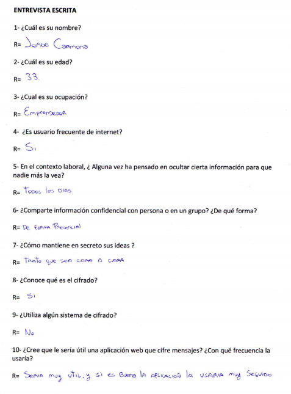

A partir de una conversación con el usuario a partir de sus decidí el grupo objetivo del proyecto, perfilé al usuario y definí cómo sería su viaje a través de la aplicación web, considerando lo que el usuario necesita y cómo yo podría cubrir esa necesidad.

### Principales usuarios

Personas de 25 a 60 años, de cualquier sexo. Pueden ser emprendedores, aspirantes a emprendedores o dueños de un negocio,y que sean socios entre sí.

### Objetivos del usuario en relación al producto

1. El usuario satisfacerá su necesidad de comunicarse con su socio en forma fácil, rápida y eficaz.
2. El usuario podrá enviar mensajes cifrados a su socio en un contexto de inicio o desarrollo de un proyecto laboral.
3. El usuario podrá utilizar la aplicación web en un ambiente de confidencialidad y seguridad, ya que los mensajes enviados solo podrán ser descifrados por el usuario receptor.

### Nivel de experiencia y de interfaz

Lo primero fue realizar el diagrama de flujo de cómo sería la interacción en la aplicación web, para luego iniciar el proceso de definir el producto final a nivel de experiencia y de interfaz. Esta etapa incluyó los siguientes pasos:

1. Etapa del prototipado

Con el fin de dar forma y formalizar las ideas, cree diferentes niveles de prototipado, de tal forma de poder visualizar la interfaz, y así después entregarle una propuesta de diseño al usuario:

a) Prototipos de baja fidelidad:

Sketch 

- A mano alzada

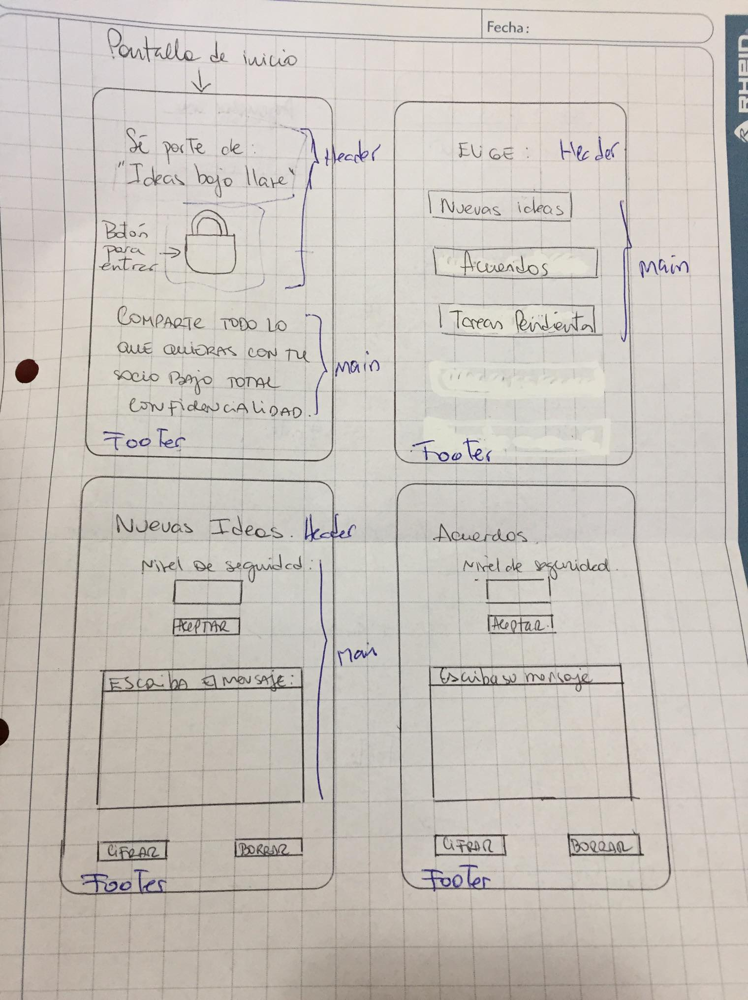

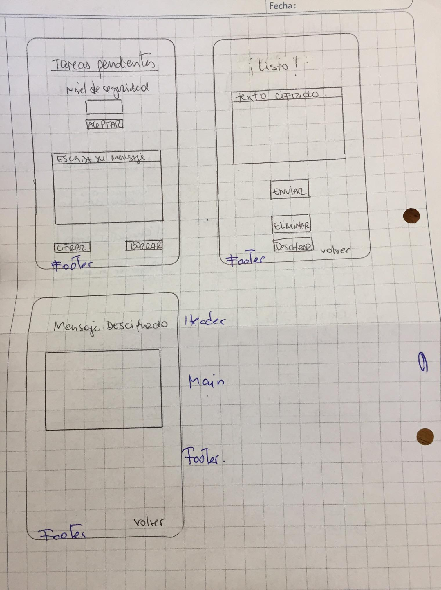

- Invision Studio 
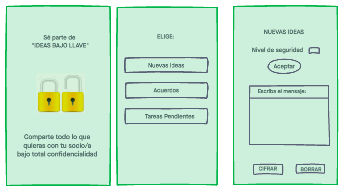

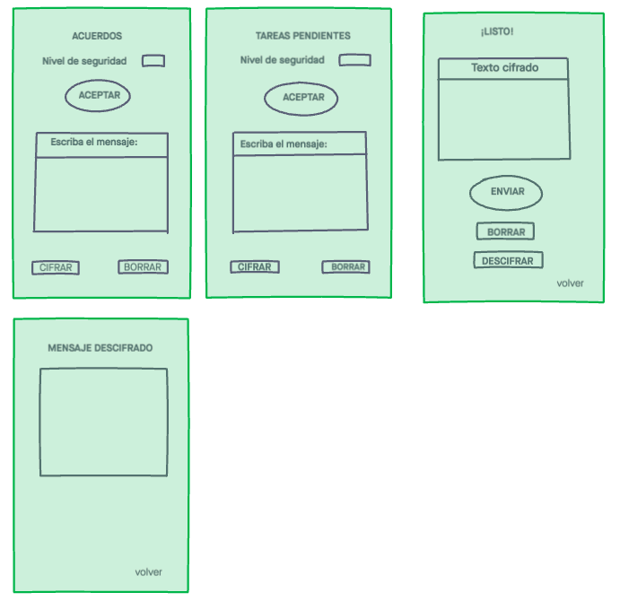

Wireframe 

- Balsamiq

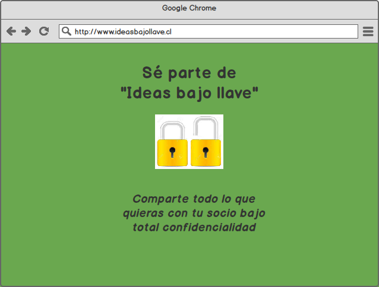

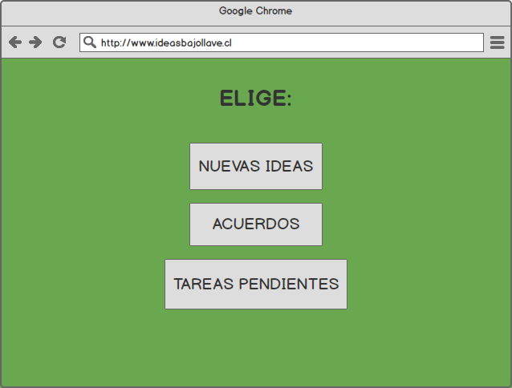

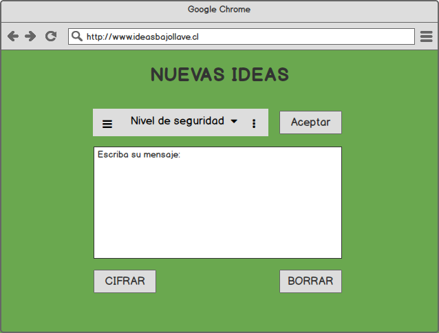

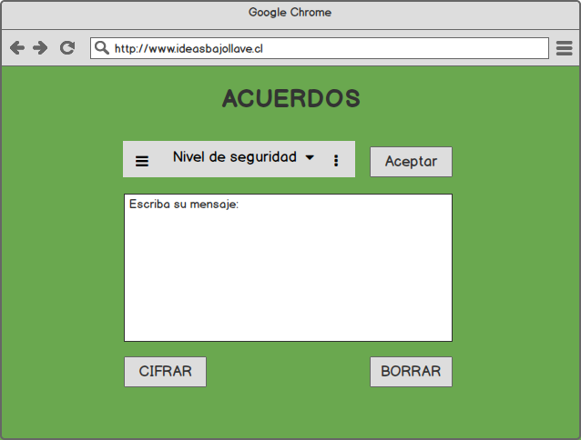

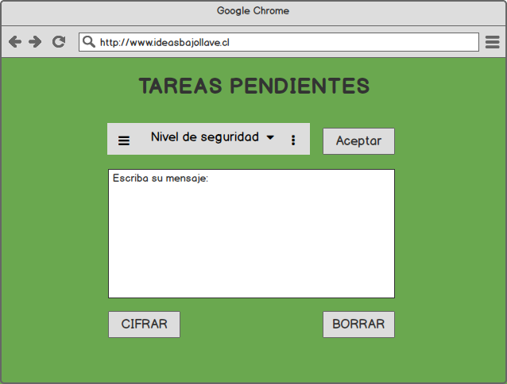

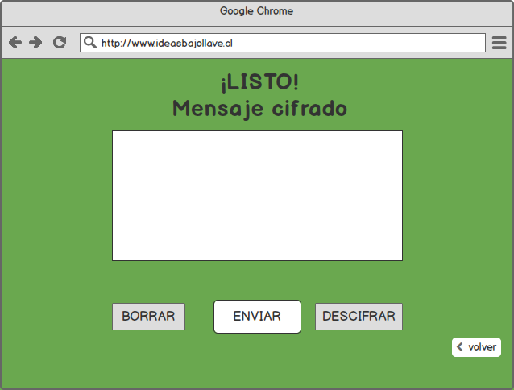

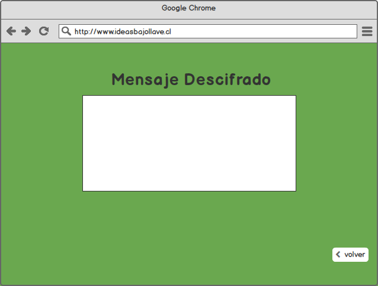

b) Prototipos de alta fidelidad:

Mockup

- Figma

[Ver prototipo aquí](https://www.figma.com/proto/WX9nhtI8glf2pp5kA3wjAq/Proyectos-bajo-llave?node-id=25%3A0&scaling=scale-down)

2. Testeo de Prototipos
En esta etapa me reuní con el usuario para iterar sobre el aspecto visual de los prototipos de baja fidelidad. El usuario aprobó la propuesta, mencionó algunas opiniones sobre el cambio del color de fondo y de los elementos y la eliminación de las últimas “pantallas”, me solicitó resumirlas de tal modo que el mensaje cifrado apareciera en el mismo cuadro de texto.
Finalmente, realicé estas modificaciones en el diseño del prototipo de alta fidelidad, en donde se incluían las interacciones y se lo presenté al usuario, el cual dio su V.B, por lo que continué a la siguiente etapa.

3. Diseño de interfaz
Comencé con el diseño de la interfaz a partir de las sugerencias entregadas por el usuario. Cree una interfaz utilizando una paleta con colores fuertes y llamativos sugeridos por el usuario, de tal forma de crear una experiencia atrayente y 
fácil de realizar.
La aplicación web consta de 5 documentos HTML. En la página de inicio se señala una breve descripción del proyecto y los usuarios a los cuales va dirigido el producto. El logo elegido, que es un candado, representa la seguiridad que se quiere entregar al usuario, y además, es la puerta de entrada a la siguiente página. En la segunda página se encuentran 3 botones para seleccionar el contexto de mensaje, en esta parte es posible interactuar mientras se va moviendo el cursor en los botones. Al seleccionar un botón se dirige a la página en donde se realiza la funcionalidad del proyecto. Existe un recuadro central que contiene la elección del número de desplazamiento (clave secreta) a través de un seleccionador con flechas, bien práctico. Luego, se encuentra el área de texto, en donde aparece la instrucción que invita a escribir el mensaje original, y de forma intuitiva el usuario debería dirigirse al botón "cifrar" que está en la parte inferior, junto con otros botones que permiten interactuar en la medida que se desplazan sobre ellos. Esos botones permiten descifrar el mensaje cifrado, eliminar cualquier texto escrito y volver a la página anterior. Dado que, toda la funcionalidad se realiza en un solo cuadro de texto, creo que la aplicación cumple la facilidad de uso que espera
un usuario.

4. Iteración con el usuario
Realicé la iteración con el mismo usuario al que le apliqué la entrevista.

5. Observaciones del usuario
A partir de las observaciones expuestas por el usuario pude rescatar que eventualmente falta una pequeña instrucción de uso en el ingreso de la clave secreta y mejorar la función del botón "borrar". También se pudo observar que es el hecho que toda la funcionalidad esté en un mismo recuadro hace que la función de la aplicación sea más entendible, aun cuando 
no se manejen a cabalidad los conceptos de cirar y descifrar, ya que al presionar los botones que realizan esa acción, el usuario pudo comprender en qué consistía la aplicación y también entendió a grandes rasgos lo que significa cifrar y descifrar.

### Introducción de la aplicación
Actualmente, existen un gran número de personas emprendedoras o dueñas de un negocio que no cuentan con una herramienta de comunicación secreta que les permita compartir información confidencial. A partir de esta premisa se determinó como grupo objetivo de la aplicación a socios de un negocio.
Este proyecto se basa en el método de cifrado césar, el cual es una técnica simple para cifrar mensajes, en donde cada letra del texto original va siendo reemplazada por otra que esté un número fijo de posiciones posteriores en el mismo alfabeto. El número de desplazamiento es a elección, en esta aplicación se le denominó "clave secreta"y de él dependerá que se realice la funcionalidad de cifrar y descifrar. 

### Funcionalidad

La aplicación web "Proyectos bajo llave" fue realizada utilizando HTML5, CSS Y JS ECMA6. Realiza la función de cifrar y descifrar un texto, mediante el uso de un nº desplazamientos elegido por el usuario.

### Intrucciones de uso
Presionar el logo central para acceder a la siguiente página, en donde se puede seleccionar el contexto del mensaje que se quiere cifrar, es decir, puede elegir entre: Nuevas ideas, Acuerdos y Tareas pendientes. Las tres opciones comparten la misma interfaz. Se comienza ingresando un clave secreta, que corresponde al nº de desplazamiento elegido para 
cifrar el mensaje. Luego en el área de texto se escribe el mensaje, se presiona el botón "cifrar" y en el mismo cuadro de texto aparecerá el mensaje cifrado. Para descifrar simplemente, debe apretarse el botón "descifrar". Para eliminar el texto escrito, se aprieta el botón "borrar" y finalmente, si se desea volver a la página en la cual se selecciona el contexto del mensaje, se debe apretar el botón "volver".

### Solución del problema
El producto creado cumple con los requerimientos básicos que el usuario manifestó en la entrevista, otorgando una interfaz fácil de usar sin detalles distractores. Permite el envío de mensajes cifrados en forma correcta y segura. 

### Conclusiones
Se concluye que, a pesar solo realicé una iteración con un usuario real, pude observar que el producto es entendible en general, al usuario no le dificultó mayormente la incursión a través de la aplicación. El usuario accedió correctamente en un tiempo corto, navegó e interactuó sin mayores problemas. Sin embargo, faltaron más iteraciones con usuarios reales para verificar la usabilidad del producto, y de esta manera, haber realizado un vaciado de la información mediante métricas, con el fin de realizar todas las mejoras necesarias que avalen a este producto como una aplicación usable, rápida y eficaz.

